# FirstModule - Unreal Engine Modular Architecture Project

## Changelog

**2025-09-26 10:55:07** - Initial AI context generation
- Created comprehensive documentation structure
- Analyzed 4 runtime modules (FirstModule, Auto, Manual, Migrate)
- Documented module dependencies and inter-module communication patterns
- Established Blueprint-C++ integration patterns

## Project Vision

FirstModule is an educational Unreal Engine 5.6 project demonstrating advanced modular architecture patterns in C++. The project serves as a comprehensive handbook for understanding UE module creation, dependency management, and Blueprint-C++ integration strategies. It showcases three different approaches to module development: IDE-generated modules (Auto), manually crafted modules (Manual), and migrated modules from external projects (Migrate).

## Architecture Overview

This project implements a layered modular architecture with clear separation of concerns:

- **Core Game Module**: `FirstModule` - Main game module providing entry point and core game logic
- **Utility Modules**: `Auto` and `Manual` - Demonstration modules showing different creation methodologies
- **External Integration**: `Migrate` - Example of module migration from external projects
- **Blueprint Integration**: Seamless C++ to Blueprint exposure through UCLASS/UFUNCTION patterns

### Module Structure Diagram

```mermaid
graph TD
    A["FirstModule (Main)"] --> B["Config"];
    A --> C["Content"];
    A --> D["Source"];
    
    D --> E["FirstModule"];
    D --> F["Auto"];
    D --> G["Manual"];
    D --> H["Migrate"];
    
    F --> I["Auto.Build.cs"];
    F --> J["Public/AutoModule.h"];
    F --> K["Public/AutoExposed.h"];
    F --> L["Public/AutoCppOnly.h"];
    
    G --> M["Manual.Build.cs"];
    G --> N["Public/ManualModule.h"];
    G --> O["Public/ManualExposed.h"];
    G --> P["Public/ManualCppOnly.h"];
    
    H --> Q["Migrate.Build.cs"];
    H --> R["Public/Migrate.h"];
    H --> S["Public/MigrateActor.h"];
    
    C --> T["Manual/BP_ManualExposed.uasset"];
    C --> U["Level/LVL_FirstModule.umap"];
    
    B --> V["DefaultEngine.ini"];
    B --> W["DefaultGame.ini"];
    B --> X["DefaultInput.ini"];
    B --> Y["DefaultEditor.ini"];

    click F "./Source/Auto/CLAUDE.md" "View Auto module documentation"
    click G "./Source/Manual/CLAUDE.md" "View Manual module documentation"
    click H "./Source/Migrate/CLAUDE.md" "View Migrate module documentation"
```



## Module Index

| Module Name | Type | Purpose | Dependencies | Blueprint Support | Creation Method |
|-------------|------|---------|--------------|-------------------|-----------------|
| **FirstModule** | Game | Main game module and entry point | Core, CoreUObject, Engine, InputCore, EnhancedInput | Yes | Standard UE |
| **Auto** | Runtime | IDE-generated module demonstrating automated creation | Core, CoreUObject, Engine | Yes | JetBrains Rider |
| **Manual** | Runtime | Hand-crafted module showing manual creation process | Core, Auto, CoreUObject, Engine | Yes | Manual |
| **Migrate** | Runtime | Migrated module from external project | Core, CoreUObject, Engine, Slate, SlateCore | Limited | Migration |

## Running and Development

### Prerequisites
- Unreal Engine 5.6 or later
- JetBrains Rider or Visual Studio 2022
- Windows 10/11 (primary platform)

### Build Instructions
1. Clone the repository
2. Right-click `FirstModule.uproject` → "Generate Visual Studio Project Files"
3. Open `FirstModule.sln` in your IDE
4. Build the solution (Ctrl+Shift+B)
5. Launch through the IDE or double-click the .uproject file

### Module Loading Verification
Check the Output Log for successful module initialization:
```
LogAuto: Warning: FAutoModule::StartupModule()
LogManual: Warning: FManualModule::StartupModule()
LogTemp: Warning: MigrateActor::AMigrateActor
```

## Testing Strategy

### Module Integration Testing
- **Inter-module Communication**: Manual module successfully calls Auto module classes
- **Blueprint Exposure**: All UCLASS-marked classes appear in Blueprint editor
- **Dependency Resolution**: Build system correctly resolves module dependencies

### Blueprint Integration Testing
- `BP_ManualExposed` inherits from `AManualExposed` C++ class
- Blueprint-callable functions work correctly in editor
- C++ constructors handle multiple Blueprint instantiations properly

### Compilation Testing
- Clean build from source compiles without errors
- Module dependency changes trigger appropriate recompilation
- Hot reload works for C++ changes during development

## Coding Standards

### Module Organization
- **Public Headers**: Only expose necessary interfaces in `Public/` folder
- **Private Implementation**: Keep implementation details in `Private/` folder
- **API Macros**: Use module-specific API macros (`MANUAL_API`, `AUTO_API`, etc.)

### Class Classification
- **CppOnly Classes**: High-performance C++ classes (no Blueprint access)
- **Exposed Classes**: Blueprint-compatible classes with UCLASS macro
- **Internal Classes**: Module-private classes in Private folder

### Naming Conventions
- Module names: PascalCase (`Auto`, `Manual`)
- Class prefixes: `F` (regular), `A` (Actor), `U` (UObject-derived)
- API macros: UPPERCASE_MODULE_API (`MANUAL_API`)

### Dependency Management
- Use `PublicDependencyModuleNames` for dependencies other modules need
- Use `PrivateDependencyModuleNames` for internal-only dependencies
- Maintain clear dependency hierarchy to avoid circular references

## AI Usage Guidelines

### Claude Code Assistant Integration
This project is optimized for AI-assisted development with clear module boundaries and comprehensive documentation. AI assistants can:

- Analyze module structure and dependencies
- Suggest improvements to modular architecture
- Help debug inter-module communication issues
- Assist with Blueprint-C++ integration patterns

### Code Analysis Patterns
- Module entry points are clearly marked with `StartupModule()`/`ShutdownModule()`
- Public interfaces are documented in module headers
- Dependencies are explicitly declared in Build.cs files
- Blueprint integration points use standard UE reflection macros

### Documentation Maintenance
- Each module maintains its own `CLAUDE.md` with specific implementation details
- Root documentation provides architectural overview and cross-module patterns
- Index file tracks module relationships and scanning coverage

## Development Workflow

### Adding New Modules
1. Create module directory structure in `Source/`
2. Add Build.cs file with appropriate dependencies
3. Create module interface class inheriting from `IModuleInterface`
4. Register module in project .uproject file
5. Update Target.cs files to include new module
6. Generate project files and build

### Module Migration Process
1. Copy source module folder to target project
2. Update target project .uproject configuration
3. Modify Target.cs files to register migrated module
4. Regenerate project files
5. Verify compilation and functionality

### Blueprint Integration
1. Mark classes with `UCLASS(Blueprintable)` for inheritance
2. Use `UFUNCTION(BlueprintCallable)` for callable methods
3. Expose properties with `UPROPERTY(BlueprintReadWrite)`
4. Keep constructors lightweight for Blueprint CDO creation